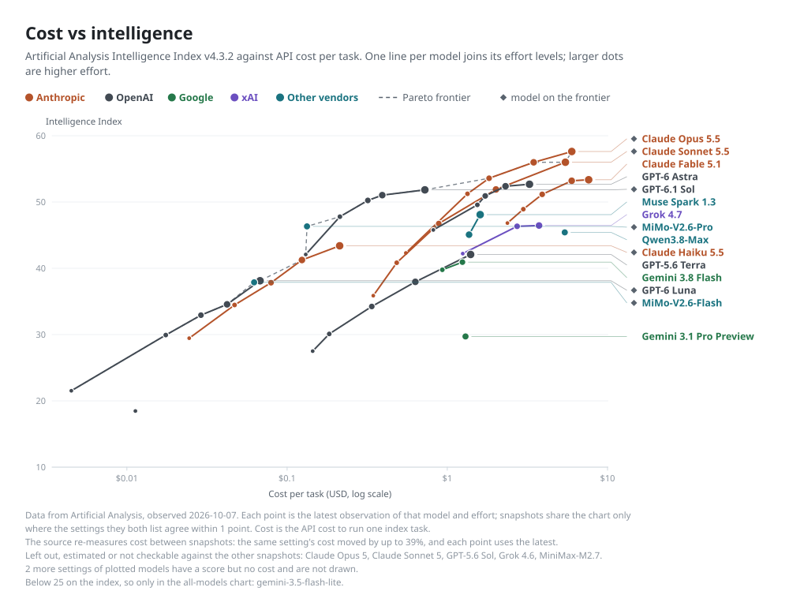

# minnows

Small tools and versioned data for working with coding agents. The main product is
[`model-catalog`](data/model-catalog/): what each model costs, how it scores, and which effort levels are worth paying for.

<picture>
  <source media="(prefers-color-scheme: dark)" srcset="data/model-catalog/charts/cost-vs-intelligence-dark.svg">
  
</picture>

*Generated from the pack. Data from [Artificial Analysis](https://artificialanalysis.ai/); every number links to a source in [`SOURCES.json`](data/model-catalog/SOURCES.json). More views, including where extra effort stops paying, are in the [model-catalog README](data/model-catalog/README.md).*

## Data packs

Versioned, schema-validated JSON. No CLI needed. Each pack declares its own version; [`data/index.json`](data/index.json) lists the latest tag and download URL of every pack.

| Pack | Use it to | |
|---|---|---|
| **[model-catalog](data/model-catalog/)** | Look up API prices, effort levels, and source-backed benchmark scores for coding-agent models. Includes the charts above. | [README](data/model-catalog/README.md) · [schema](data/model-catalog/SCHEMA.md) |
| **[model-choice-policy](data/model-choice-policy/)** | Pick a model and effort for a kind of task (review, recover, implement, …). Policy only; it pins a catalog version. | [README](data/model-choice-policy/README.md) |
| **[decision-model-catalog](data/decision-model-catalog/)** | Compare small models built for fast typed decisions on an agent's hot path, with latency and caveats. | [README](data/decision-model-catalog/README.md) |
| **[local-evals](data/local-evals/)** | Check that a policy op runs end to end. Harness smoke tests, **not** quality evidence. | [README](data/local-evals/README.md) |

```bash
./scripts/fetch-data-pack.sh model-catalog            # latest
./scripts/fetch-data-pack.sh model-catalog v0.5.12    # pin a version
```

Or open a [GitHub Release](https://github.com/tnunamak/minnows/releases?q=data-) and download the tarball.

## Tools

Each tool is a CLI that a person or an agent can run. Some also ship a `SKILL.md` so agents find them.

| Tool | Skill | What it does |
|---|:---:|---|
| **[convo](tools/convo/)** | ✓ | Read past agent conversations across Claude Code, Codex, Gemini, Qwen, Pi and DeepSeek. |
| **[uncompact](tools/uncompact/)** | ✓ | Recover a Claude Code session lost to context compaction. |
| **[slopgate](tools/slopgate/)** | ✓ | Measure and cut AI slop in a draft before you ship it. |
| **[hone](tools/hone/)** | — | Repo-quality engine: inventory, ranked packets, maker ≠ judge. |
| **[unfinished](tools/unfinished/)** | — | Find decisions, plans and promises in your agent sessions that were never finished, check them against git and GitHub, and keep a ledger. |
| **[model-policy-ops](tools/model-policy-ops/)** | — | Read the `model-choice-policy` pack and expand an operating point into model and effort flags. |

## Install

```bash
./install.sh    # skills, bins on PATH, data packs → ~/.local/share/minnows-data
```

It is idempotent, and `~/.local/bin` must be on your `PATH`. Then:

```bash
export DATA_PACKS_HOME="${DATA_PACKS_HOME:-$HOME/.local/share/minnows-data}"
cat "$DATA_PACKS_HOME/model-catalog/pack.json"
```

## Contributing

Layout, packaging rules, how to add a tool or a pack, and how releases work: [CONTRIBUTING.md](CONTRIBUTING.md).
For a new model or new benchmark data: [docs/playbooks/model-rollout.md](docs/playbooks/model-rollout.md).
