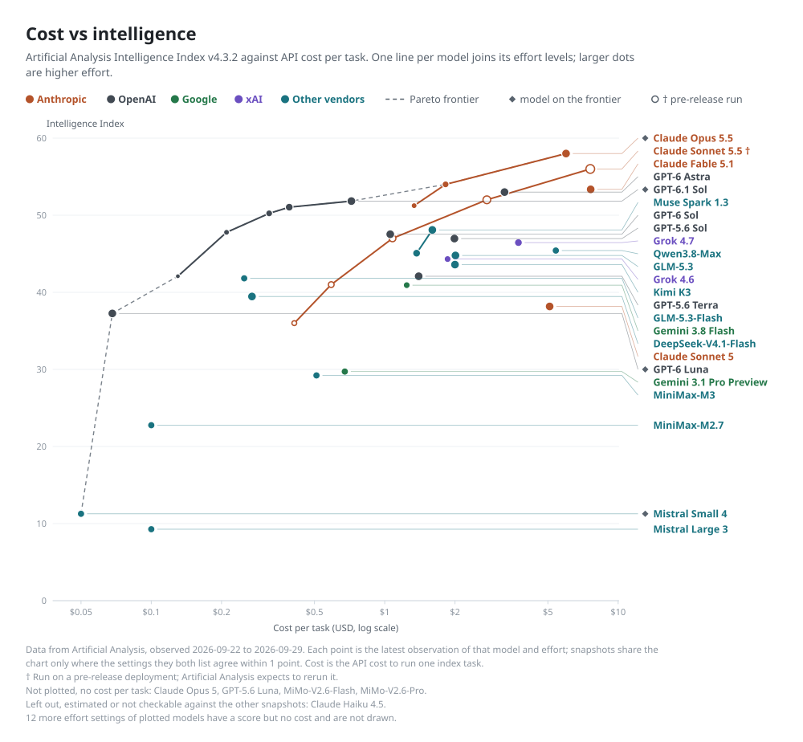
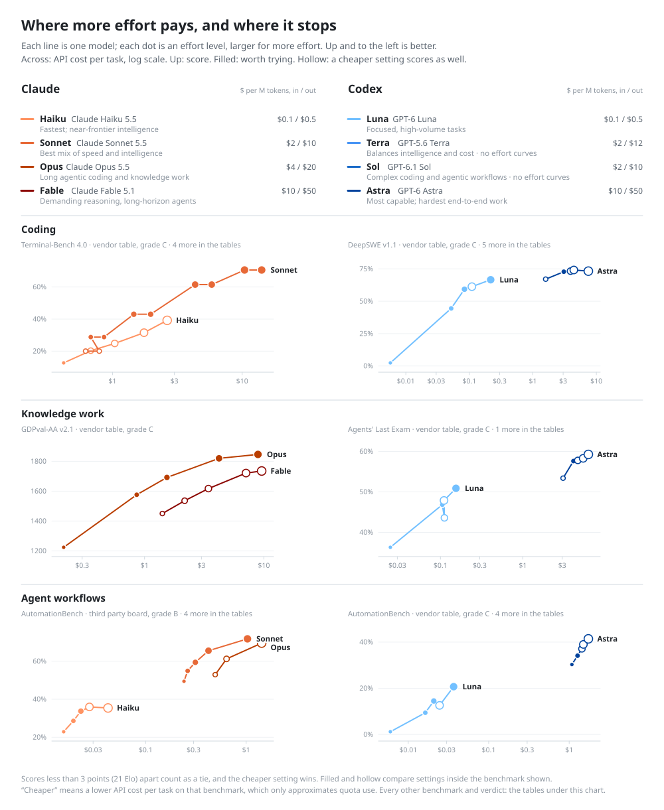
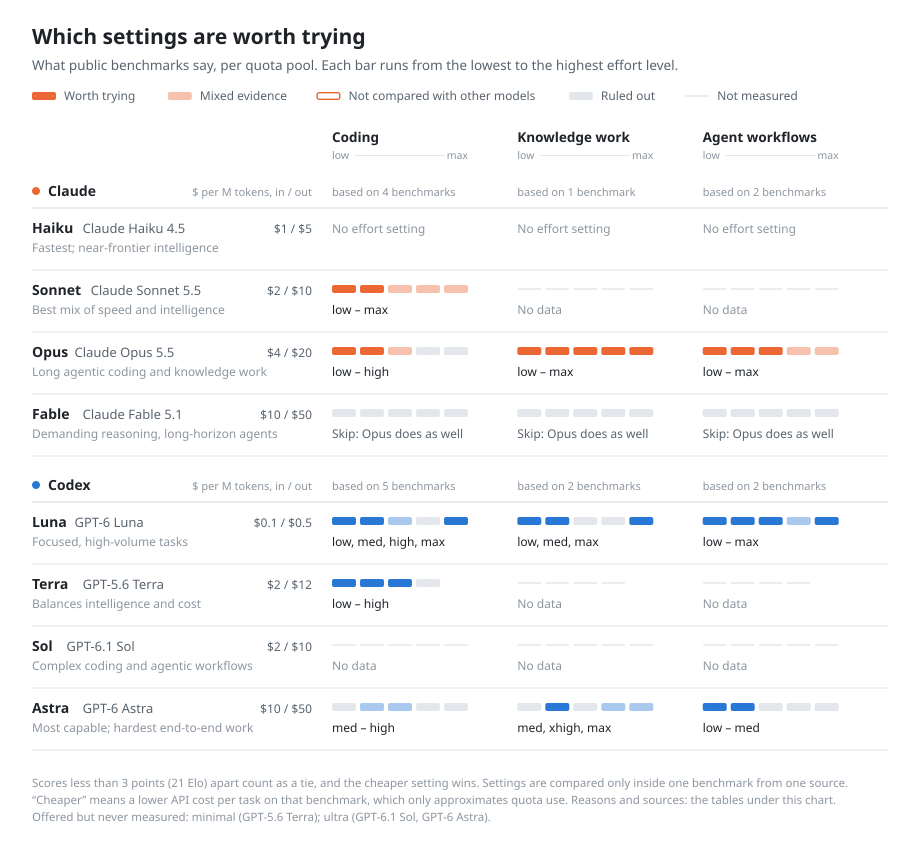

# Data pack: `model-catalog`

Versioned **pricing** and **source-backed quality/effort** facts for coding-agent model choice.

Not a CLI. Not a skill. Just versioned, **schema-validated** JSON with a **provenance registry**.

## Choosing a model and an effort level

Public benchmarks measure other people's tasks, so use them to narrow the choice. A setting is ruled out when another setting in the same quota pool costs less and scores as well. The chart shows where more effort pays and where it stops.

<!-- option-map:begin -->
<!-- Generated by scripts/render_model_catalog_charts.py. Edit guide.json or the data, not this block. -->

<picture>
  <source media="(prefers-color-scheme: dark)" srcset="charts/cost-vs-intelligence-dark.svg">
  
</picture>

**Reading the chart.** Up is smarter, left is cheaper. The frontier (dashed) holds the settings that no other setting beats on both cost and score: GPT-6 Luna low to xhigh (21.5–34.6 at $0.0045–$0.042), MiMo-V2.6-Flash (37.9 at $0.062), GPT-6 Luna max (38.1 at $0.068), Claude Haiku 5.5 xhigh (41.2 at $0.12), GPT-6.1 Sol low (42.1 at $0.13), MiMo-V2.6-Pro (46.3 at $0.13), GPT-6.1 Sol medium to max (47.8–51.8 at $0.21–$0.72), Claude Opus 5.5 high to xhigh (53.6–56.0 at $1.82–$3.46), Claude Sonnet 5.5 max (56.0 at $5.46), Claude Opus 5.5 max (57.6 at $5.98). The top score is Claude Opus 5.5 max at 57.6 for $5.98 per task. Data from Artificial Analysis, observed 2026-09-22 to 2026-10-07. Each point is the latest observation of that model and effort; snapshots share the chart only where the settings they both list agree within 1 point. Cost is the API cost to run one index task. The source re-measures cost between snapshots: the same setting's cost moved by up to 39%, and each point uses the latest. Not plotted, no cost per task: Claude Opus 5. 1 more setting of plotted models has a score but no cost and is not drawn.

<details><summary><b>All 29 models</b> on the same axes</summary>

<picture>
  <source media="(prefers-color-scheme: dark)" srcset="charts/cost-vs-intelligence-all-dark.svg">
  
</picture>

</details>

<details><summary><b>Data behind the chart</b>: 65 settings, one row per model and effort</summary>

| Model | Effort | Intelligence Index | $/task | Observed | Note |
|---|---|---|---|---|---|
| Claude Opus 5.5 | low | 42.3 | $0.55 | 2026-10-07 |  |
| Claude Opus 5.5 | medium | 51.2 | $1.34 | 2026-10-07 |  |
| Claude Opus 5.5 | high | 53.6 | $1.82 | 2026-10-07 | on the frontier |
| Claude Opus 5.5 | xhigh | 56.0 | $3.46 | 2026-10-07 | on the frontier |
| Claude Opus 5.5 | max | 57.6 | $5.98 | 2026-10-07 | on the frontier |
| Claude Sonnet 5.5 | low | 35.9 | $0.35 | 2026-10-07 |  |
| Claude Sonnet 5.5 | medium | 40.8 | $0.48 | 2026-10-07 |  |
| Claude Sonnet 5.5 | high | 46.8 | $0.88 | 2026-10-07 |  |
| Claude Sonnet 5.5 | xhigh | 51.9 | $2.01 | 2026-10-07 |  |
| Claude Sonnet 5.5 | max | 56.0 | $5.46 | 2026-10-07 | on the frontier |
| Claude Fable 5.1 | low | 46.8 | $2.37 | 2026-10-07 |  |
| Claude Fable 5.1 | medium | 48.9 | $2.98 | 2026-10-07 |  |
| Claude Fable 5.1 | high | 51.2 | $3.91 | 2026-10-07 |  |
| Claude Fable 5.1 | xhigh | 53.2 | $5.98 | 2026-10-07 |  |
| Claude Fable 5.1 | max | 53.4 | $7.63 | 2026-10-07 |  |
| GPT-6 Astra | low | 45.8 | $0.82 | 2026-10-07 |  |
| GPT-6 Astra | medium | 49.6 | $1.54 | 2026-10-07 |  |
| GPT-6 Astra | high | 50.9 | $1.73 | 2026-10-07 |  |
| GPT-6 Astra | xhigh | 52.4 | $2.31 | 2026-10-07 |  |
| GPT-6 Astra | max | 52.7 | $3.26 | 2026-10-07 |  |
| GPT-6.1 Sol | low | 42.1 | $0.13 | 2026-10-07 | on the frontier |
| GPT-6.1 Sol | medium | 47.8 | $0.21 | 2026-10-07 | on the frontier |
| GPT-6.1 Sol | high | 50.2 | $0.32 | 2026-10-07 | on the frontier |
| GPT-6.1 Sol | xhigh | 51.0 | $0.39 | 2026-10-07 | on the frontier |
| GPT-6.1 Sol | max | 51.8 | $0.72 | 2026-10-07 | on the frontier |
| Muse Spark 1.3 | xhigh | 45.1 | $1.37 | 2026-09-23 |  |
| Muse Spark 1.3 | max | 48.1 | $1.60 | 2026-10-07 |  |
| GPT-6 Sol | Non-reasoning | 28.5 | $0.33 | 2026-10-07 |  |
| GPT-6 Sol | low | 34.2 | $0.13 | 2026-10-07 |  |
| GPT-6 Sol | medium | 39.8 | $0.25 | 2026-10-07 |  |
| GPT-6 Sol | high | 42.4 | $0.37 | 2026-10-07 |  |
| GPT-6 Sol | xhigh | 44.2 | $0.52 | 2026-10-07 |  |
| GPT-6 Sol | max | 47.6 | $1.04 | 2026-10-07 |  |
| GPT-5.6 Sol | max | 47.0 | $1.99 | 2026-09-22 |  |
| Grok 4.7 | xhigh | 46.4 | $3.74 | 2026-10-07 |  |
| MiMo-V2.6-Pro | – | 46.3 | $0.13 | 2026-10-07 | on the frontier |
| Qwen3.8-Max | – | 45.4 | $5.41 | 2026-09-23 |  |
| GLM-5.3 | max | 44.8 | $2.01 | 2026-10-07 |  |
| Grok 4.6 | high | 44.3 | $1.86 | 2026-09-23 |  |
| Kimi K3 | max | 43.6 | $2.00 | 2026-09-23 |  |
| Claude Haiku 5.5 | low | 29.4 | $0.025 | 2026-10-07 |  |
| Claude Haiku 5.5 | medium | 34.5 | $0.047 | 2026-10-07 |  |
| Claude Haiku 5.5 | high | 37.8 | $0.079 | 2026-10-07 |  |
| Claude Haiku 5.5 | xhigh | 41.2 | $0.12 | 2026-10-07 | on the frontier |
| Claude Haiku 5.5 | max | 43.4 | $0.21 | 2026-10-07 |  |
| GPT-5.6 Terra | max | 42.1 | $1.40 | 2026-09-22 |  |
| GLM-5.3-Flash | – | 41.8 | $0.25 | 2026-09-23 |  |
| GLM-5.3-Flash | max | 41.8 | $0.25 | 2026-10-07 |  |
| Gemini 3.8 Flash | high | 40.9 | $1.24 | 2026-09-23 |  |
| DeepSeek-V4.1-Flash | max | 39.5 | $0.27 | 2026-10-07 |  |
| Claude Sonnet 5 | max | 38.2 | $5.09 | 2026-09-22 |  |
| GPT-6 Luna | Non-reasoning | 18.5 | $0.011 | 2026-10-07 |  |
| GPT-6 Luna | low | 21.5 | $0.0045 | 2026-10-07 | on the frontier |
| GPT-6 Luna | medium | 29.9 | $0.018 | 2026-10-07 | on the frontier |
| GPT-6 Luna | high | 32.9 | $0.029 | 2026-10-07 | on the frontier |
| GPT-6 Luna | xhigh | 34.6 | $0.042 | 2026-10-07 | on the frontier |
| GPT-6 Luna | max | 38.1 | $0.068 | 2026-10-07 | on the frontier |
| MiMo-V2.6-Flash | – | 37.9 | $0.062 | 2026-10-07 | on the frontier |
| GPT-5.6 Luna | max | 37.3 | $0.18 | 2026-10-07 |  |
| Gemini 3.1 Pro Preview | – | 29.7 | $0.67 | 2026-09-23 |  |
| MiniMax-M3 | – | 29.2 | $0.51 | 2026-09-23 |  |
| MiniMax-M2.7 | – | 22.8 | $0.10 | 2026-09-23 |  |
| Claude Haiku 4.5 | Reasoning | 16.9 | $0.28 | 2026-10-07 |  |
| Mistral Small 4 | – | 11.3 | $0.05 | 2026-09-23 |  |
| Mistral Large 3 | – | 9.3 | $0.10 | 2026-09-23 |  |

–: the model has no effort setting, or the source does not name one.

</details>

<picture>
  <source media="(prefers-color-scheme: dark)" srcset="charts/effort-curves-dark.svg">
  
</picture>

<details><summary><b>Verdicts across all benchmarks</b>, not only the one charted above</summary>

<picture>
  <source media="(prefers-color-scheme: dark)" srcset="charts/option-map-dark.svg">
  
</picture>

<details><summary><b>Claude</b>: the reason behind each cell</summary>

| Task | Model | low | medium | high | xhigh | max |
|---|---|---|---|---|---|---|
| Coding | Claude Haiku 5.5 | ● | ◐ low (2 of 3) | ◐ Claude Sonnet 5.5 medium (2 of 4) | ◐ Claude Sonnet 5.5 medium (2 of 4) | ◐ Claude Sonnet 5.5 high (2 of 4) |
| Coding | Claude Sonnet 5.5 | ◐ Claude Haiku 5.5 xhigh (2 of 4) | ◐ Claude Haiku 5.5 xhigh (2 of 4) | ◐ medium (1 of 9) | ◐ Claude Opus 5.5 medium (2 of 5) | ◐ xhigh (2 of 9) |
| Coding | Claude Opus 5.5 | ◐ Claude Sonnet 5.5 xhigh (1 of 5) | ◐ low (1 of 8) | ◐ medium (2 of 7) | ← high (6 of 6) | ← high (6 of 6) |
| Coding | Claude Fable 5.1 | ✕ Claude Opus 5.5 medium (3 of 3) | ✕ Claude Opus 5.5 medium (3 of 3) | ✕ Claude Opus 5.5 medium (3 of 3) | ✕ Claude Opus 5.5 medium (3 of 3) | ✕ Claude Opus 5.5 high (4 of 4) |
| Knowledge work | Claude Haiku 5.5 | · | · | · | · | · |
| Knowledge work | Claude Sonnet 5.5 | · | · | · | · | · |
| Knowledge work | Claude Opus 5.5 | ● | ● | ● | ● | ● |
| Knowledge work | Claude Fable 5.1 | ✕ Claude Opus 5.5 medium (1 of 1) | ✕ Claude Opus 5.5 medium (1 of 1) | ✕ Claude Opus 5.5 high (1 of 1) | ✕ Claude Opus 5.5 xhigh (1 of 1) | ✕ Claude Opus 5.5 xhigh (1 of 1) |
| Agent workflows | Claude Haiku 5.5 | ● | ● | ◐ medium (1 of 4) | ◐ high (2 of 4) | ◐ xhigh (2 of 4) |
| Agent workflows | Claude Sonnet 5.5 | ◐ Claude Haiku 5.5 xhigh (3 of 4) | ◐ Claude Haiku 5.5 xhigh (3 of 4) | ◐ Claude Haiku 5.5 max (1 of 4) | ◐ high (1 of 4) | ◐ xhigh (1 of 4) |
| Agent workflows | Claude Opus 5.5 | ◐ Claude Sonnet 5.5 xhigh (2 of 4) | ◐ Claude Sonnet 5.5 high (3 of 4) | ● | ◐ high (1 of 2) | ◐ Claude Sonnet 5.5 max (3 of 4) |
| Agent workflows | Claude Fable 5.1 | ✕ Claude Opus 5.5 medium (1 of 1) | ✕ Claude Opus 5.5 medium (1 of 1) | ✕ Claude Opus 5.5 high (1 of 1) | ✕ Claude Opus 5.5 high (1 of 1) | ✕ Claude Opus 5.5 high (1 of 1) |

✕ *model effort (n of n)*: that cheaper setting scores as well on every benchmark they share. ← *effort*: the same, for a lower effort of this model. ◐ *(k of n)*: cheaper and as good on k of the n benchmarks they share. ○: not yet compared with other models.

| Task | Benchmark | Source | Grade | Models compared |
|---|---|---|---|---|
| Coding | CursorBench 3.2.0 | [`performance/anthropic-fable-mythos-5-1-2026-09.json`](performance/anthropic-fable-mythos-5-1-2026-09.json) · vendor table | C | Claude Fable 5.1 |
| Coding | CursorBench 4.0 | [`performance/anthropic-opus-5-5-system-card-2026-09.json`](performance/anthropic-opus-5-5-system-card-2026-09.json) · vendor table | B | Claude Fable 5.1, Claude Opus 5.5 |
| Coding | CursorBench 4.0 | [`performance/anthropic-sonnet5-5-digitized-2026-09.json`](performance/anthropic-sonnet5-5-digitized-2026-09.json) · vendor table | C | Claude Opus 5.5, Claude Sonnet 5.5 |
| Coding | CursorBench 4.0 | [`performance/anthropic-opus5-5-digitized-2026-09.json`](performance/anthropic-opus5-5-digitized-2026-09.json) · vendor table | C | Claude Fable 5.1, Claude Opus 5.5 |
| Coding | FrontierCode v1.1 (Main) | [`performance/anthropic-sonnet5-5-digitized-2026-09.json`](performance/anthropic-sonnet5-5-digitized-2026-09.json) · vendor table | C | Claude Opus 5.5, Claude Sonnet 5.5 |
| Coding | FrontierCode v1.1 (Main) | [`performance/anthropic-opus5-5-digitized-2026-09.json`](performance/anthropic-opus5-5-digitized-2026-09.json) · vendor table | C | Claude Fable 5.1, Claude Opus 5.5 |
| Coding | FrontierCode v1.1 (Main) | [`performance/openai-gpt-6-sol-luna-launch-curves-2026-09.json`](performance/openai-gpt-6-sol-luna-launch-curves-2026-09.json) · vendor table | C | Claude Fable 5.1 |
| Coding | SciCode | [`performance/artificial-analysis-claude-haiku-5-5-2026-10-07.json`](performance/artificial-analysis-claude-haiku-5-5-2026-10-07.json) · third party board | B | Claude Haiku 5.5, Claude Opus 5.5, Claude Sonnet 5.5 |
| Coding | Terminal-Bench 4.0 | [`performance/anthropic-fable-mythos-5-1-2026-09.json`](performance/anthropic-fable-mythos-5-1-2026-09.json) · vendor table | C | Claude Fable 5.1 |
| Coding | Terminal-Bench 4.0 | [`performance/anthropic-haiku5-5-digitized-2026-10.json`](performance/anthropic-haiku5-5-digitized-2026-10.json) · vendor table | C | Claude Haiku 5.5, Claude Sonnet 5.5 |
| Coding | Terminal-Bench 4.0 | [`performance/anthropic-sonnet5-5-digitized-2026-09.json`](performance/anthropic-sonnet5-5-digitized-2026-09.json) · vendor table | C | Claude Opus 5.5, Claude Sonnet 5.5 |
| Coding | Terminal-Bench 4.0 | [`performance/artificial-analysis-claude-haiku-5-5-2026-10-07.json`](performance/artificial-analysis-claude-haiku-5-5-2026-10-07.json) · third party board | B | Claude Haiku 5.5, Claude Opus 5.5, Claude Sonnet 5.5 |
| Coding | Terminal-Bench 4.0 | [`performance/anthropic-opus5-5-digitized-2026-09.json`](performance/anthropic-opus5-5-digitized-2026-09.json) · vendor table | C | Claude Fable 5.1, Claude Opus 5.5 |
| Coding | Terminal-Bench 4.0 | [`performance/terminal-bench-4-vals-opus-5-5-2026-09.json`](performance/terminal-bench-4-vals-opus-5-5-2026-09.json) · other | C | Claude Fable 5.1, Claude Opus 5.5 |
| Knowledge work | GDPval-AA v2.1 | [`performance/anthropic-opus5-5-digitized-2026-09.json`](performance/anthropic-opus5-5-digitized-2026-09.json) · vendor table | C | Claude Fable 5.1, Claude Opus 5.5 |
| Agent workflows | AA-Briefcase v1.1 | [`performance/artificial-analysis-claude-haiku-5-5-2026-10-07.json`](performance/artificial-analysis-claude-haiku-5-5-2026-10-07.json) · third party board | B | Claude Haiku 5.5, Claude Opus 5.5, Claude Sonnet 5.5 |
| Agent workflows | AutomationBench | [`performance/artificial-analysis-claude-haiku-5-5-2026-10-07.json`](performance/artificial-analysis-claude-haiku-5-5-2026-10-07.json) · third party board | B | Claude Haiku 5.5, Claude Opus 5.5, Claude Sonnet 5.5 |
| Agent workflows | AutomationBench | [`performance/anthropic-opus5-5-digitized-2026-09.json`](performance/anthropic-opus5-5-digitized-2026-09.json) · vendor table | C | Claude Opus 5.5 |
| Agent workflows | gdp.pdf | [`performance/artificial-analysis-claude-haiku-5-5-2026-10-07.json`](performance/artificial-analysis-claude-haiku-5-5-2026-10-07.json) · third party board | B | Claude Haiku 5.5, Claude Opus 5.5, Claude Sonnet 5.5 |
| Agent workflows | GDPval-AA v2.1 | [`performance/artificial-analysis-claude-haiku-5-5-2026-10-07.json`](performance/artificial-analysis-claude-haiku-5-5-2026-10-07.json) · third party board | B | Claude Haiku 5.5, Claude Opus 5.5, Claude Sonnet 5.5 |
| Agent workflows | WANDR | [`performance/anthropic-opus5-5-digitized-2026-09.json`](performance/anthropic-opus5-5-digitized-2026-09.json) · vendor table | C | Claude Fable 5.1, Claude Opus 5.5 |

</details>

<details><summary><b>Codex</b>: the reason behind each cell</summary>

| Task | Model | low | medium | high | xhigh | max |
|---|---|---|---|---|---|---|
| Coding | GPT-6 Luna | ● | ◐ low (1 of 4) | ◐ medium (3 of 4) | ◐ high (3 of 4) | ◐ xhigh (1 of 4) |
| Coding | GPT-5.6 Terra | ● | ● | ● | ✕ GPT-6 Astra low (1 of 1) | n/a |
| Coding | GPT-6.1 Sol | ◐ GPT-6 Luna xhigh (1 of 2) | ◐ low (1 of 2) | · | · | ◐ medium (1 of 2) |
| Coding | GPT-6 Astra | ✕ GPT-6 Luna max (2 of 2) | ◐ low (1 of 8) | ◐ medium (6 of 8) | ← high (8 of 8) | ← xhigh (8 of 8) |
| Knowledge work | GPT-6 Luna | ● | ● | ← medium (1 of 1) | ← medium (1 of 1) | ● |
| Knowledge work | GPT-5.6 Terra | · | · | · | · | n/a |
| Knowledge work | GPT-6.1 Sol | · | · | · | · | · |
| Knowledge work | GPT-6 Astra | ✕ GPT-6 Luna max (1 of 1) | ● | ← medium (2 of 2) | ◐ medium (1 of 2) | ◐ xhigh (1 of 2) |
| Agent workflows | GPT-6 Luna | ● | ● | ● | ◐ high (4 of 6) | ● |
| Agent workflows | GPT-5.6 Terra | · | · | · | · | n/a |
| Agent workflows | GPT-6.1 Sol | ◐ GPT-6 Luna max (3 of 4) | ◐ GPT-6 Luna max (1 of 4) | · | · | ◐ medium (2 of 4) |
| Agent workflows | GPT-6 Astra | ● | ● | ← medium (3 of 3) | ← high (3 of 3) | ← xhigh (3 of 3) |

✕ *model effort (n of n)*: that cheaper setting scores as well on every benchmark they share. ← *effort*: the same, for a lower effort of this model. ◐ *(k of n)*: cheaper and as good on k of the n benchmarks they share. ○: not yet compared with other models.

| Task | Benchmark | Source | Grade | Models compared |
|---|---|---|---|---|
| Coding | DeepSWE Leaderboard (datacurve.ai) | [`performance/google-xai-board-snapshot-2026-09-23.json`](performance/google-xai-board-snapshot-2026-09-23.json) · third party board | B | GPT-5.6 Terra, GPT-6 Astra |
| Coding | DeepSWE v1.1 | [`performance/openai-gpt-6-astra-launch-2026-09.json`](performance/openai-gpt-6-astra-launch-2026-09.json) · vendor table | C | GPT-6 Astra |
| Coding | DeepSWE v1.1 | [`performance/openai-gpt-6-sol-luna-launch-curves-2026-09.json`](performance/openai-gpt-6-sol-luna-launch-curves-2026-09.json) · vendor table | C | GPT-6 Astra, GPT-6 Luna |
| Coding | FrontierCode 1.1 Extended | [`performance/openai-gpt-6-astra-launch-2026-09.json`](performance/openai-gpt-6-astra-launch-2026-09.json) · vendor table | C | GPT-6 Astra |
| Coding | FrontierCode v1.1 (Main) | [`performance/anthropic-opus5-5-digitized-2026-09.json`](performance/anthropic-opus5-5-digitized-2026-09.json) · vendor table | C | GPT-6 Astra |
| Coding | FrontierCode v1.1 (Main) | [`performance/openai-gpt-6-sol-luna-launch-curves-2026-09.json`](performance/openai-gpt-6-sol-luna-launch-curves-2026-09.json) · vendor table | C | GPT-6 Astra, GPT-6 Luna |
| Coding | SciCode | [`performance/artificial-analysis-claude-haiku-5-5-2026-10-07.json`](performance/artificial-analysis-claude-haiku-5-5-2026-10-07.json) · third party board | B | GPT-6 Astra, GPT-6 Luna, GPT-6.1 Sol |
| Coding | Terminal-Bench 4.0 | [`performance/artificial-analysis-claude-haiku-5-5-2026-10-07.json`](performance/artificial-analysis-claude-haiku-5-5-2026-10-07.json) · third party board | B | GPT-6 Astra, GPT-6 Luna, GPT-6.1 Sol |
| Coding | Terminal-Bench 4.0 | [`performance/anthropic-opus5-5-digitized-2026-09.json`](performance/anthropic-opus5-5-digitized-2026-09.json) · vendor table | C | GPT-6 Astra |
| Coding | Terminal-Bench 4.0 | [`performance/openai-gpt-6-astra-launch-2026-09.json`](performance/openai-gpt-6-astra-launch-2026-09.json) · vendor table | C | GPT-6 Astra |
| Knowledge work | Agents' Last Exam | [`performance/openai-gpt-6-sol-luna-launch-curves-2026-09.json`](performance/openai-gpt-6-sol-luna-launch-curves-2026-09.json) · vendor table | C | GPT-6 Astra, GPT-6 Luna |
| Knowledge work | GDPval-AA v2.1 | [`performance/anthropic-opus5-5-digitized-2026-09.json`](performance/anthropic-opus5-5-digitized-2026-09.json) · vendor table | C | GPT-6 Astra |
| Agent workflows | AA-Briefcase v1.1 | [`performance/artificial-analysis-claude-haiku-5-5-2026-10-07.json`](performance/artificial-analysis-claude-haiku-5-5-2026-10-07.json) · third party board | B | GPT-6 Astra, GPT-6 Luna, GPT-6.1 Sol |
| Agent workflows | AutomationBench | [`performance/artificial-analysis-claude-haiku-5-5-2026-10-07.json`](performance/artificial-analysis-claude-haiku-5-5-2026-10-07.json) · third party board | B | GPT-6 Astra, GPT-6 Luna, GPT-6.1 Sol |
| Agent workflows | AutomationBench | [`performance/anthropic-opus5-5-digitized-2026-09.json`](performance/anthropic-opus5-5-digitized-2026-09.json) · vendor table | C | GPT-6 Astra |
| Agent workflows | AutomationBench | [`performance/openai-gpt-6-sol-luna-launch-curves-2026-09.json`](performance/openai-gpt-6-sol-luna-launch-curves-2026-09.json) · vendor table | C | GPT-6 Astra, GPT-6 Luna |
| Agent workflows | gdp.pdf | [`performance/artificial-analysis-claude-haiku-5-5-2026-10-07.json`](performance/artificial-analysis-claude-haiku-5-5-2026-10-07.json) · third party board | B | GPT-6 Astra, GPT-6 Luna, GPT-6.1 Sol |
| Agent workflows | GDPval-AA v2.1 | [`performance/artificial-analysis-claude-haiku-5-5-2026-10-07.json`](performance/artificial-analysis-claude-haiku-5-5-2026-10-07.json) · third party board | B | GPT-6 Astra, GPT-6 Luna, GPT-6.1 Sol |
| Agent workflows | OSWorld 2.0 (partial score) | [`performance/openai-gpt-6-sol-luna-launch-curves-2026-09.json`](performance/openai-gpt-6-sol-luna-launch-curves-2026-09.json) · vendor table | C | GPT-6 Astra, GPT-6 Luna |

</details>

</details>

<!-- option-map:end -->

For the settings that are left:

- Give each role a fixed model and effort level. The [`model-choice-policy`](../model-choice-policy/) pack records these defaults (`waspflow ops list`).
- Move up an effort level or a tier when verification fails. A passing check does not prove that the cheaper setting was enough.
- Every benchmark here is a hard task. For mechanical work, such as renames and lookups, compare token prices instead.

Most of these numbers come from vendor launch charts (grade C) without error bars. Subscription quota is metered differently from the API dollars used here.

For independently run comparisons across many more models, including speed and latency, see [Artificial Analysis](https://artificialanalysis.ai/models).

## Get this pack (click / copy — no URL math)

| | |
|---|---|
| **Latest release** | [data-model-catalog releases](https://github.com/tnunamak/minnows/releases?q=data-model-catalog&expanded=true) — open the newest, hit **Assets → Download** |
| **This version** | [data-model-catalog-v0.5.11](https://github.com/tnunamak/minnows/releases/tag/data-model-catalog-v0.5.11) — published by CI on push to main |
| **All data packs** | [data/README.md](../README.md) |
| **Machine index** | [data/index.json](../index.json) on `main` |
| **Schemas** | [SCHEMA.md](SCHEMA.md) · [schemas/](schemas/) |
| **Provenance** | [SOURCES.json](SOURCES.json) — every score/rate links here |

### Full pack

```bash
TAG=data-model-catalog-v0.5.9
curl -fsSL -L \
  "https://github.com/tnunamak/minnows/releases/download/${TAG}/${TAG}.tar.gz" \
  | tar -xz

# or
./scripts/fetch-data-pack.sh model-catalog
./scripts/fetch-data-pack.sh model-catalog v0.4.2
```

### Local

```bash
export DATA_PACKS_HOME="${DATA_PACKS_HOME:-$HOME/.local/share/minnows-data}"
# after ./install.sh → $DATA_PACKS_HOME/model-catalog/pack.json
./scripts/validate_data_pack.py model-catalog
```

## Layout

| Path | Role |
|---|---|
| `pack.json` | Envelope (tag, file list, schema pointers) |
| `models.json` | **L0 model registry** — canonical ids + aliases (join key) |
| `metrics.json` | Metric registry (comparability boundary)
| `SOURCES.json` | **Provenance registry** — id → URL / publisher / kind |
| `SCHEMA.md` / `schemas/` | Contracts — pricing + performance + sources v1 |
| `pricing/*.json` | USD/MTok or Codex credits (tokensmash-compatible) |
| `performance/*.json` | Vendor + third-party scores/claims |
| `capabilities/*.json` | Effort/mode surfaces per model |
| `digitized/` | Chart extraction artifacts (case-by-case) |
| `guide.json` | Inputs for the README charts: quota pools, tiers, task families, tie rule, display labels |
| `charts/` | README effort curves and option map, light and dark SVG. Generated by `scripts/render_model_catalog_charts.py`; do not edit by hand |

### Performance documents (v0.3)

| File | What | Primary sources |
|------|------|-----------------|
| `anthropic-effort-quality-2026-07.json` | Sonnet 5 effort×cost framing | Anthropic Sonnet 5 post |
| `openai-quality-2026-07.json` | GPT-5.5 launch evals | OpenAI GPT-5.5 post |
| `openai-gpt-5-6-launch-2026-07.json` | **Full GPT-5.6 Sol/Terra/Luna tables** (coding, cyber, science, long-context, ARC-AGI-3 headline, …) | [openai.com/index/gpt-5-6](https://openai.com/index/gpt-5-6/) |
| `arcprize-gpt-5-6-2026-07.json` | **Effort-stratified ARC-AGI-1/2/3** + Sol cost/task | [ARC Prize GPT-5.6](https://arcprize.org/results/openai-gpt-5-6) |

### How to see where a number came from

1. Open a score/claim row → read `source_id` (or the document’s `source_ids[]`).
2. Look up that id in `SOURCES.json` → get URL, publisher, published date, `kind`.
3. Prefer `third_party_eval` over `vendor_blog` when they disagree on the same metric family (e.g. ARC).

## Rules of use

1. **Pin a tag** for studies; only `data/index.json` is meant to float on `main`.
2. **Never invent rates or scores** — omit or list under `missing[]`.
3. **Quota ≠ cost** — [clawmeter](https://github.com/tnunamak/clawmeter) for remaining allowance.
4. **Vendor tables are directional** until independently reproduced.
5. **Validate before shipping:** `./scripts/validate_data_pack.py model-catalog`

### v0.5.11 — 2026-09-30

- Corrected the GPT-6.1 Sol Codex CLI surface note: codex-cli 0.159.2 lists the model and a local run served it. The older note said 0.156.1 did not list it. No other data changes.

### v0.5.10 — 2026-09-29

- Added OpenAI GPT-6.1 Sol as a GA Sol-tier model in the GPT-6 family, current API standard pricing, separate API and Codex effort surfaces, Hone entry without calibration, launch claims, and selected system-card rows.
- Kept GPT-6 Sol GA: OpenAI still lists it for Work and Codex and has not announced deprecation. No model-choice-policy changes.
- Raw launch HTML returned HTTP 403, so benchmark table cells and full SVG curves remain listed as missing rather than reconstructed from secondary sources.
- Added launch-day Artificial Analysis rows for GPT-6.1 Sol and provisional board coverage (recheck 2026-10-06). Added Xiaomi MiMo-V2.6 Pro and Flash (release 2026-09-22) with first-party pricing and Arena and Artificial Analysis rows. StepFun Step 5 Preview is not in `models.json`: its API model id is unpublished.

## Changelog

See [CHANGELOG.md](CHANGELOG.md).

## Query cookbook

Cheapest-ish operational models with grade ≥ B evidence on a coding metric (illustrative jq):

```bash
# models with at least one grade-B coding score
jq -r '
  .scores[]?
  | select(.evidence_grade=="B" and .task_family=="coding")
  | [.model, .metric, .score, .effort // "-", .harness // "-"] | @tsv
' data/model-catalog/performance/*.json | sort -u
```

Join price (API USD) for a model id:

```bash
jq -r --arg m claude-sonnet-5 '
  .models[$m] // empty
' data/model-catalog/pricing/anthropic-api-2026-07.json
```
